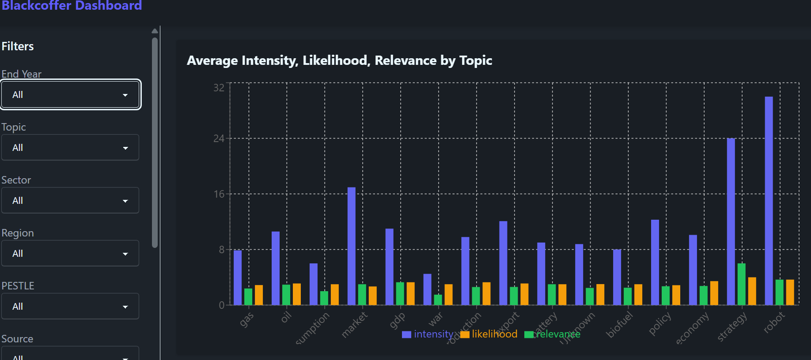

# 📊 Blackcoffer Visualization Dashboard

An interactive data visualization dashboard built using the **MERN stack**.  
The dashboard provides powerful filtering and visual insights based on data from a MongoDB database.

🚀 **Live Demo:** [Blackcoffer Visualization Dashboard](https://blackcoffer-visualization-dashboard-yxtm.onrender.com/)

---

## 📷 Screenshot



---

## ✨ Features

- **Interactive Charts & Graphs** for data analysis
- **Dynamic Filters** to explore insights efficiently
- **Responsive UI** built with DaisyUI
- **Integrated Backend API** (Express + MongoDB)
- **Deployed on Render** with combined frontend and backend

---

## 🛠 Tech Stack

**Frontend:**

- React.js  
- DaisyUI (Tailwind CSS)  

**Backend:**

- Node.js  
- Express.js  
- MongoDB (Mongoose ORM)

---

## 📌 Environment Variables

Create a `.env` file in the backend directory with the following variables:  

```env
PORT=

MONGO_USER=
MONGO_PASSWORD=
MONGO_CLUSTER=
MONGO_DB_NAME=
MONGO_APP_NAME=
⚠️ Note: Replace the above values with your own MongoDB credentials if running locally.

## 🚀 Installation & Setup

### 1️⃣ Clone the repository
```bash
git clone https://github.com/abhijitmanna912001/blackcoffer-visualization-dashboard
cd blackcoffer-visualization-dashboard

2️⃣ Install backend dependencies
bash
Copy
Edit
cd backend
npm install
3️⃣ Install frontend dependencies
bash
Copy
Edit
cd ../frontend
npm install
4️⃣ Configure Environment Variables
Create a .env file in the backend directory with the following variables:

env
Copy
Edit
PORT=

MONGO_USER=
MONGO_PASSWORD=
MONGO_CLUSTER=
MONGO_DB_NAME=
MONGO_APP_NAME=
⚠️ Note: Fill these with your own credentials if running locally.

5️⃣ Build frontend & link to backend
From the backend folder:

bash
Copy
Edit
npm run build-frontend
6️⃣ Start development mode
bash
Copy
Edit
npm run dev
The backend will run with nodemon and serve the frontend from public/.

📦 Deployment
This project is deployed on Render.

For production:

bash
Copy
Edit
npm run build-frontend
npm start


🧠 How It Works
Backend serves API routes at /api/data

Frontend fetches and visualizes data dynamically

When deployed, the backend also serves the built frontend from public/

👨‍💻 Author
Developed by Abhijit Manna
